

<h1 align="center">Zorbatron's GT:CEu Extras</h1>

<i>Things that I (Zorbatron), want in GregTech, but probably don't belong in the base mod</i>

  An addon mod for <a href="https://github.com/GregTechCEu/GregTech">GregTech CEu</a>

<h1 align="center">
    
    
     
    
    
    
</h1>

## Features:

### Multiblocks:

Ported the following multiblocks from GT:NH:
- Mega Electric Blast Furnace (mEBF)
- Mega LCR (mLCR)
- Mega Vacuum Freezer (mVF)
- Mega Oil Cracking Unit (mOCU)
- Mega Alloy Blast Smelter (mABS)
- Precise Assembler (PRASS)
- Component Assembly Line (CoAL)
- YOTTank and YOTHatch

My multiblocks:
- Quad EBF (qEBF)
- Queezer (quad vacuum freezer)

### Images (_In order with the above list_):
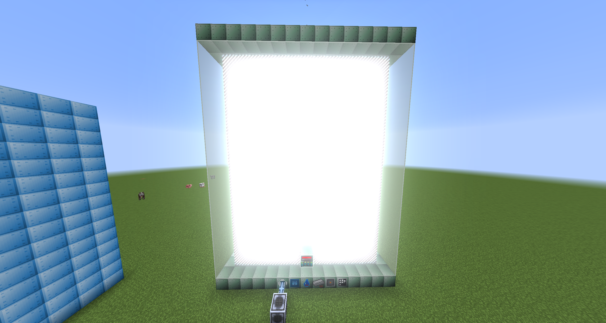
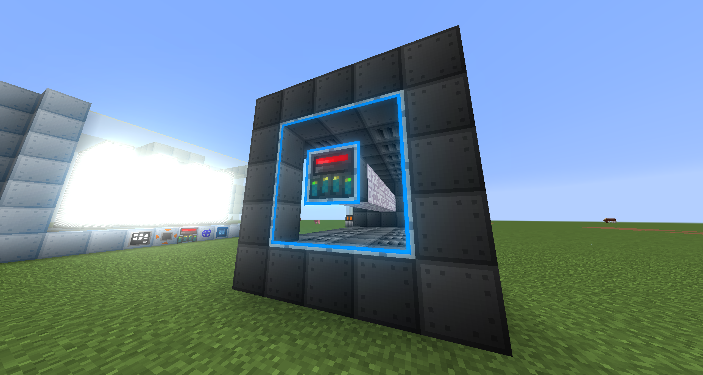
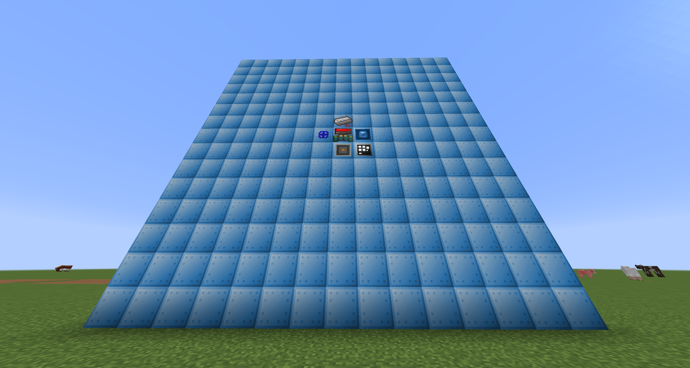

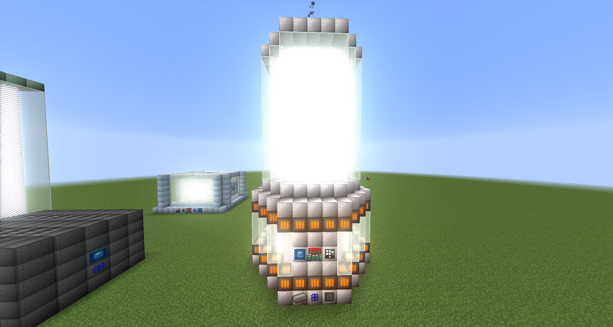
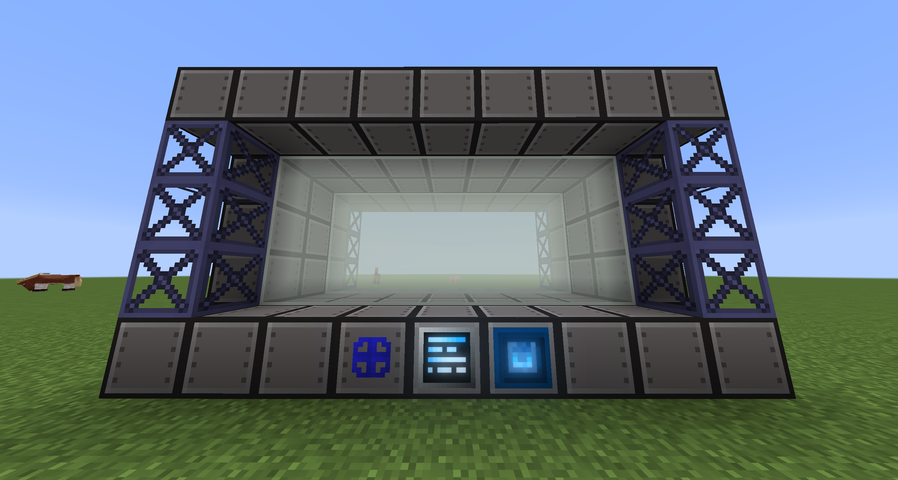
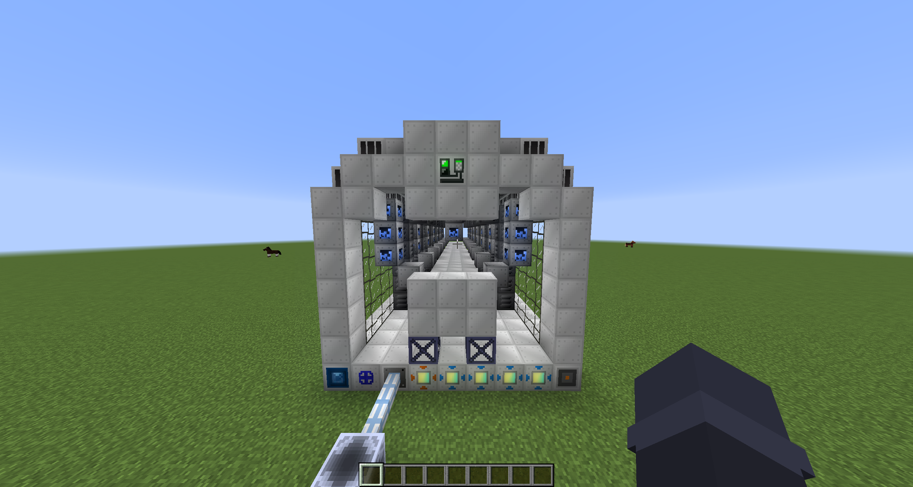
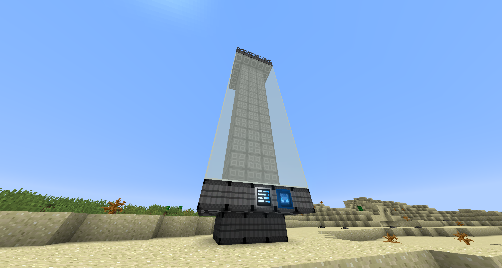

  
### My multiblocks:
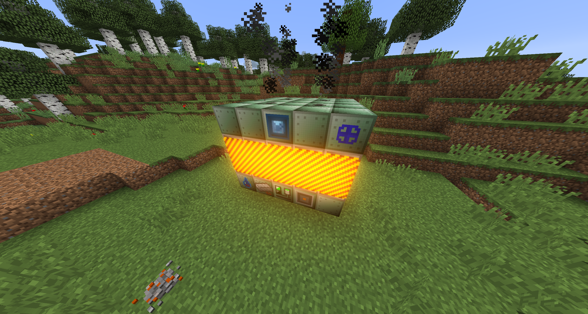
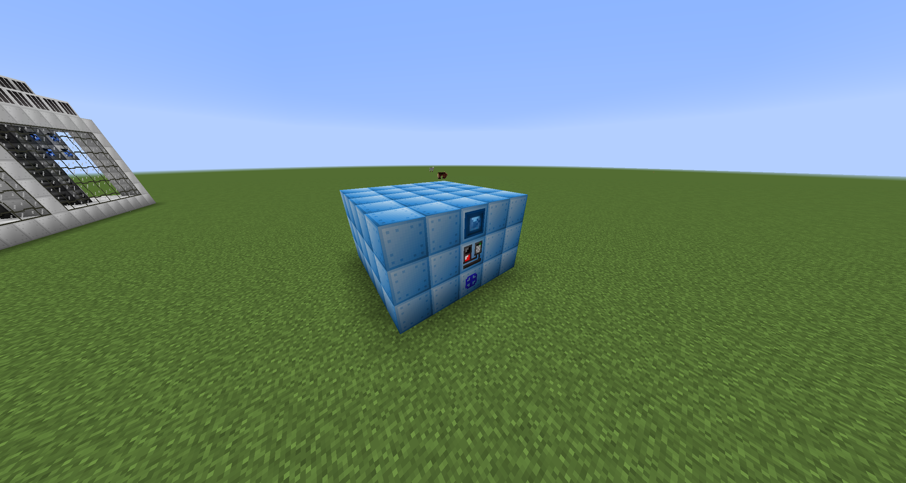

### Multiblock Parts:

Creative Energy Source
- Configurable like the creative emitter, but as a multiblock part.
- You need to make the multiblock reform when you change its setting because right now because GregTech doesn't have a way for an energy container to notify the multiblock controller that its voltage/amperage has changed.

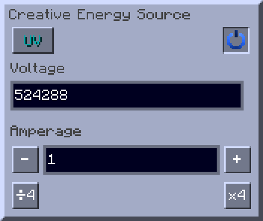

Creative Energy Sink
- Behaves the same as the Creative Energy Hatch but drains energy from the multiblock instead of providing.
- Same UI as the Creative Energy Source

Creative Item Bus
- An input bus that can be set to any 16 items and provides them to the connected multiblock

Super Input Bus
- An input bus that has 16 slots but each slot can hold up to MAX_INT items
- Depending on how many items are inside, it may take a while to empty back into and interface until AE2UEL PR [#448](https://github.com/AE2-UEL/Applied-Energistics-2/pull/448) makes its way into a stable release (v0.56.6 is NOT stable)

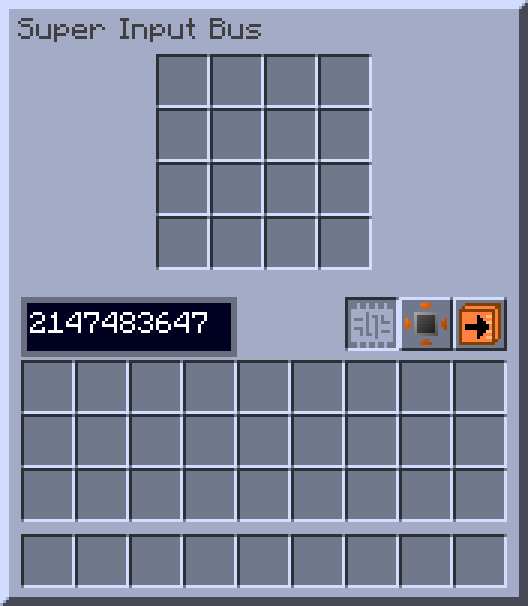

Creative Fluid Hatch
- Same as the normal reservoir hatch but can be changed to provide other fluids.

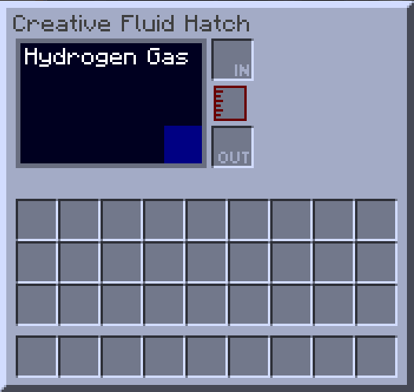

Creative Computation Provider
- Acts as an HPCA that can supply up to 2,147,483,647 CWU/t!
- Backported from GregTech Modern, and will be moved into base CEu once M-W-K finishes their PipeNet rewrite.

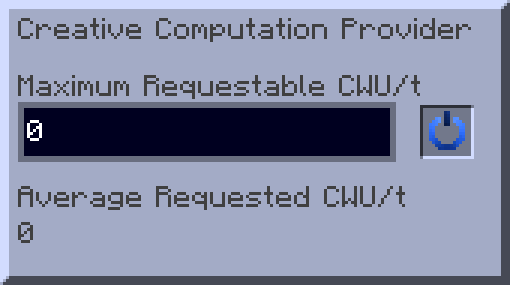

Dual Cover
- Combines the conveyor and pump into one cover!

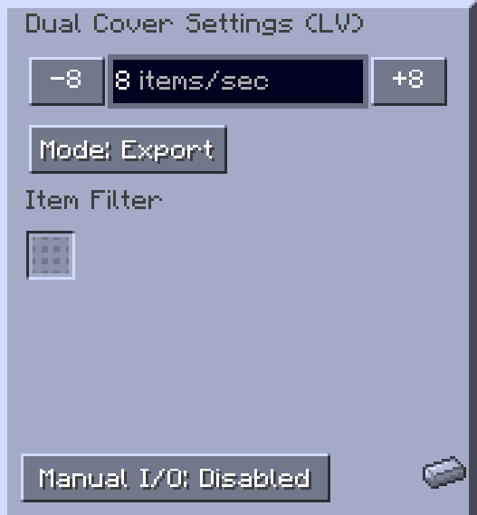
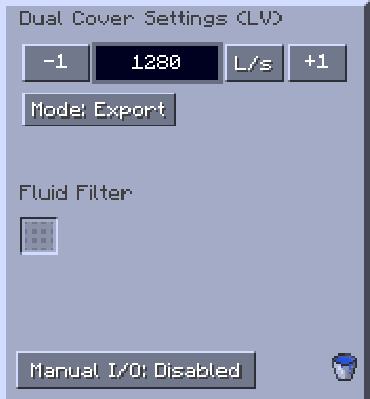

Precise Dual Cover
- Combines the robot arm and fluid regulator into one cover!

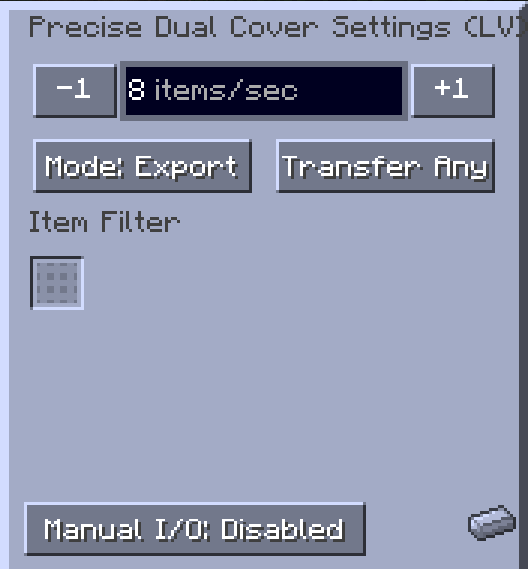
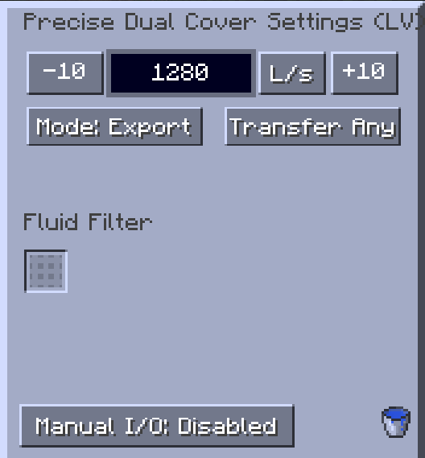

Air Intake Hatch
- Ported from GT++ but it collects dimensions specific gas now!
- Is a Gas Collector that passively generates air.

Single Item Input Bus
- Functionally identical to a ULV input bus, but it has a max stack size of 1.

## Credited Works
- [GT:NH](https://github.com/GTNewHorizons/) for many of the multiblocks and 
- Ursamina for the dual cover textures and the icon! :heart:
- [Synthitic](https://github.com/Synthitic/) for porting GT:NH's CoAL to [GCYL: CEu](https://github.com/Synthitic/GCYL-CEu), which I more or less directly copied.
- [GT:CEu](https://github.com/GregTechCEu/GregTech) for much code inspiration.